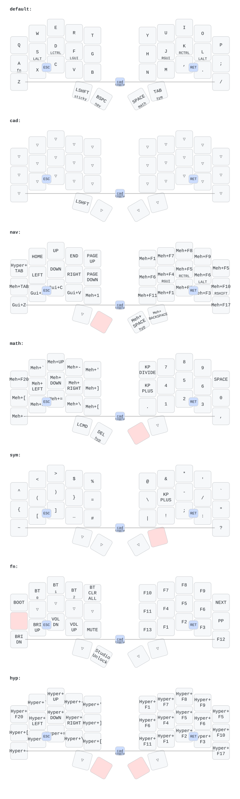

# ZMK Configuration for DokoDemo

*Generated by Shield Wizard for ZMK*


Download compiled firmware from the Actions tab. <https://zmk.dev/docs/user-setup#installing-the-firmware>

Edit your keymap <https://zmk.dev/docs/keymaps>.
User keymap is located at [`config/dokodemo.keymap`](config/dokodemo.keymap).

## Current keymap



Regenerate the parsed keymap and SVG with:

```sh
make keymap
```

This uses the globally installed `keymap` executable. Saving
`keymap-drawer/keymap.yaml` in VS Code also redraws the SVG when the recommended
Run on Save extension is installed.

-----

<details>
<summary>
Shield Wizard Debug Information
</summary>

In case of broken configuration, here is the Shield Wizard internal data used to generate this configuration:

Commit: 5840d41ac0915092c8fe45da617ffb4bb91e1b97

```json
{"name":"DokoDemo","shield":"dokodemo","dongle":true,"modules":[],"layout":[{"id":"01KRG133Z24AQ691BD7ATRP5XG","part":0,"row":0,"col":0,"w":1,"h":1,"x":0,"y":0.95,"r":0,"rx":0,"ry":0},{"id":"01KRG133Z2VSJHANRMHY87AFYZ","part":0,"row":0,"col":1,"w":1,"h":1,"x":1,"y":0.32,"r":0,"rx":0,"ry":0},{"id":"01KRG133Z2CBAWNTC76CEFX5JK","part":0,"row":0,"col":2,"w":1,"h":1,"x":2,"y":0,"r":0,"rx":0,"ry":0},{"id":"01KRG133Z2YZ811D3NDECM8NCC","part":0,"row":0,"col":3,"w":1,"h":1,"x":3,"y":0.28,"r":0,"rx":0,"ry":0},{"id":"01KRG133Z2MEAJH7YHMJFT7AHN","part":0,"row":0,"col":4,"w":1,"h":1,"x":4,"y":0.42,"r":0,"rx":0,"ry":0},{"id":"01KRG133Z2YA9A6W2W6ZT3RQPQ","part":1,"row":0,"col":5,"w":1,"h":1,"x":7,"y":0.42,"r":0,"rx":0,"ry":0},{"id":"01KRG133Z2YR6B4083TF0NKCVY","part":1,"row":0,"col":6,"w":1,"h":1,"x":8,"y":0.28,"r":0,"rx":0,"ry":0},{"id":"01KRG133Z26GBDP9PHDZN82RQV","part":1,"row":0,"col":7,"w":1,"h":1,"x":9,"y":0,"r":0,"rx":0,"ry":0},{"id":"01KRG133Z29K8Z5GN3X6VGVJKS","part":1,"row":0,"col":8,"w":1,"h":1,"x":10,"y":0.32,"r":0,"rx":0,"ry":0},{"id":"01KRG133Z23MF7M6NZND6XRC5T","part":1,"row":0,"col":9,"w":1,"h":1,"x":11,"y":0.95,"r":0,"rx":0,"ry":0},{"id":"01KRG133Z2J8RWY5K77345QRDB","part":0,"row":1,"col":0,"w":1,"h":1,"x":0,"y":1.95,"r":0,"rx":0,"ry":0},{"id":"01KRG133Z2GBNR25GX3MJ6RHRJ","part":0,"row":1,"col":1,"w":1,"h":1,"x":1,"y":1.32,"r":0,"rx":0,"ry":0},{"id":"01KRG133Z2DVBY0JSBB4EREC9F","part":0,"row":1,"col":2,"w":1,"h":1,"x":2,"y":1,"r":0,"rx":0,"ry":0},{"id":"01KRG133Z2N2PATZ5QPWG4F2SN","part":0,"row":1,"col":3,"w":1,"h":1,"x":3,"y":1.29,"r":0,"rx":0,"ry":0},{"id":"01KRG133Z2SNT80D0TPEBCVYM6","part":0,"row":1,"col":4,"w":1,"h":1,"x":4,"y":1.42,"r":0,"rx":0,"ry":0},{"id":"01KRG133Z2DPCR5K4B11BK0H8C","part":1,"row":1,"col":5,"w":1,"h":1,"x":7,"y":1.42,"r":0,"rx":0,"ry":0},{"id":"01KRG133Z213J96Y5DAKJCE3Z3","part":1,"row":1,"col":6,"w":1,"h":1,"x":8,"y":1.29,"r":0,"rx":0,"ry":0},{"id":"01KRG133Z2QTYCN8KC3CMSDV67","part":1,"row":1,"col":7,"w":1,"h":1,"x":9,"y":1,"r":0,"rx":0,"ry":0},{"id":"01KRG133Z218BN3RXR27BYTB4C","part":1,"row":1,"col":8,"w":1,"h":1,"x":10,"y":1.32,"r":0,"rx":0,"ry":0},{"id":"01KRG133Z25ZBB80NYDHSZPGNA","part":1,"row":1,"col":9,"w":1,"h":1,"x":11,"y":1.95,"r":0,"rx":0,"ry":0},{"id":"01KRG133Z2WY1HZN6BFQ3NYTG7","part":0,"row":2,"col":0,"w":1,"h":1,"x":0,"y":2.95,"r":0,"rx":0,"ry":0},{"id":"01KRG133Z2V6WNSTCM145H3YJG","part":0,"row":2,"col":1,"w":1,"h":1,"x":1,"y":2.31,"r":0,"rx":0,"ry":0},{"id":"01KRG133Z2Q5ZTNDVE0GDMV3KH","part":0,"row":2,"col":2,"w":1,"h":1,"x":2,"y":2,"r":0,"rx":0,"ry":0},{"id":"01KRG133Z3S8J58VWTH8XZT5BG","part":0,"row":2,"col":3,"w":1,"h":1,"x":3,"y":2.29,"r":0,"rx":0,"ry":0},{"id":"01KRG133Z32SNYDGDPHD9FN7JV","part":0,"row":2,"col":4,"w":1,"h":1,"x":4,"y":2.42,"r":0,"rx":0,"ry":0},{"id":"01KRG133Z3XKTC0JNBZDVCY7Q1","part":1,"row":2,"col":5,"w":1,"h":1,"x":7,"y":2.42,"r":0,"rx":0,"ry":0},{"id":"01KRG133Z3T21S5005444C3Q88","part":1,"row":2,"col":6,"w":1,"h":1,"x":8,"y":2.29,"r":0,"rx":0,"ry":0},{"id":"01KRG133Z3V6N4R0DMTH582Z0Q","part":1,"row":2,"col":7,"w":1,"h":1,"x":9,"y":2,"r":0,"rx":0,"ry":0},{"id":"01KRG133Z3K444Y7FV62DP92F6","part":1,"row":2,"col":8,"w":1,"h":1,"x":10,"y":2.31,"r":0,"rx":0,"ry":0},{"id":"01KRG133Z331Y4813P577Z8774","part":1,"row":2,"col":9,"w":1,"h":1,"x":11,"y":2.95,"r":0,"rx":0,"ry":0},{"id":"01KRG133Z31JT44MHPBC1286E8","part":0,"row":3,"col":3,"w":1,"h":1,"x":3.3,"y":3.55,"r":15,"rx":4.3,"ry":4.55},{"id":"01KRG133Z3B3NTDT5K4P7HB2EB","part":0,"row":3,"col":4,"w":1,"h":1,"x":4.3,"y":3.55,"r":30,"rx":4.3,"ry":4.55},{"id":"01KRG133Z3PSKP81ZY09X0KFDJ","part":1,"row":3,"col":5,"w":1,"h":1,"x":6.7,"y":3.55,"r":-30,"rx":7.7,"ry":4.55},{"id":"01KRG133Z3A991EE447EHPHBS9","part":1,"row":3,"col":6,"w":1,"h":1,"x":7.7,"y":3.55,"r":-15,"rx":7.7,"ry":4.55}],"parts":[{"name":"left","controller":"xiao_ble","wiring":"matrix_diode","pins":{"d2":"input","d3":"input","d4":"input","d5":"input","d6":"input","d10":"output","d9":"output","d8":"output","d7":"output"},"keys":{"01KRG133Z24AQ691BD7ATRP5XG":{"input":"d2","output":"d10"},"01KRG133Z2J8RWY5K77345QRDB":{"input":"d2","output":"d9"},"01KRG133Z2WY1HZN6BFQ3NYTG7":{"input":"d2","output":"d8"},"01KRG133Z2VSJHANRMHY87AFYZ":{"input":"d3","output":"d10"},"01KRG133Z2GBNR25GX3MJ6RHRJ":{"input":"d3","output":"d9"},"01KRG133Z2V6WNSTCM145H3YJG":{"input":"d3","output":"d8"},"01KRG133Z2CBAWNTC76CEFX5JK":{"input":"d4","output":"d10"},"01KRG133Z2DVBY0JSBB4EREC9F":{"input":"d4","output":"d9"},"01KRG133Z2Q5ZTNDVE0GDMV3KH":{"input":"d4","output":"d8"},"01KRG133Z2YZ811D3NDECM8NCC":{"input":"d5","output":"d10"},"01KRG133Z2N2PATZ5QPWG4F2SN":{"input":"d5","output":"d9"},"01KRG133Z3S8J58VWTH8XZT5BG":{"input":"d5","output":"d8"},"01KRG133Z31JT44MHPBC1286E8":{"input":"d5","output":"d7"},"01KRG133Z2MEAJH7YHMJFT7AHN":{"input":"d6","output":"d10"},"01KRG133Z2SNT80D0TPEBCVYM6":{"input":"d6","output":"d9"},"01KRG133Z32SNYDGDPHD9FN7JV":{"input":"d6","output":"d8"},"01KRG133Z3B3NTDT5K4P7HB2EB":{"input":"d6","output":"d7"}},"encoders":[],"buses":[{"name":"spi0","devices":[],"type":"spi"},{"name":"spi1","devices":[],"type":"spi"},{"name":"spi2","devices":[],"type":"spi"},{"name":"spi3","devices":[],"type":"spi"},{"name":"i2c0","devices":[],"type":"i2c"},{"name":"i2c1","devices":[],"type":"i2c"}]},{"name":"right","controller":"xiao_ble","wiring":"matrix_diode","pins":{"d10":"output","d9":"output","d8":"output","d7":"output","d2":"input","d3":"input","d4":"input","d5":"input","d6":"input"},"keys":{"01KRG133Z2YA9A6W2W6ZT3RQPQ":{"input":"d6","output":"d10"},"01KRG133Z2YR6B4083TF0NKCVY":{"input":"d5","output":"d10"},"01KRG133Z26GBDP9PHDZN82RQV":{"input":"d4","output":"d10"},"01KRG133Z29K8Z5GN3X6VGVJKS":{"input":"d3","output":"d10"},"01KRG133Z23MF7M6NZND6XRC5T":{"input":"d2","output":"d10"},"01KRG133Z25ZBB80NYDHSZPGNA":{"input":"d2","output":"d9"},"01KRG133Z218BN3RXR27BYTB4C":{"input":"d3","output":"d9"},"01KRG133Z213J96Y5DAKJCE3Z3":{"input":"d5","output":"d9"},"01KRG133Z2QTYCN8KC3CMSDV67":{"input":"d4","output":"d9"},"01KRG133Z2DPCR5K4B11BK0H8C":{"input":"d6","output":"d9"},"01KRG133Z331Y4813P577Z8774":{"input":"d2","output":"d8"},"01KRG133Z3K444Y7FV62DP92F6":{"input":"d3","output":"d8"},"01KRG133Z3V6N4R0DMTH582Z0Q":{"input":"d4","output":"d8"},"01KRG133Z3T21S5005444C3Q88":{"input":"d5","output":"d8"},"01KRG133Z3XKTC0JNBZDVCY7Q1":{"input":"d6","output":"d8"},"01KRG133Z3A991EE447EHPHBS9":{"input":"d5","output":"d7"},"01KRG133Z3PSKP81ZY09X0KFDJ":{"input":"d6","output":"d7"}},"encoders":[],"buses":[{"name":"spi0","devices":[],"type":"spi"},{"name":"spi1","devices":[],"type":"spi"},{"name":"spi2","devices":[],"type":"spi"},{"name":"spi3","devices":[],"type":"spi"},{"name":"i2c0","devices":[],"type":"i2c"},{"name":"i2c1","devices":[],"type":"i2c"}]}]}
```

</details>
